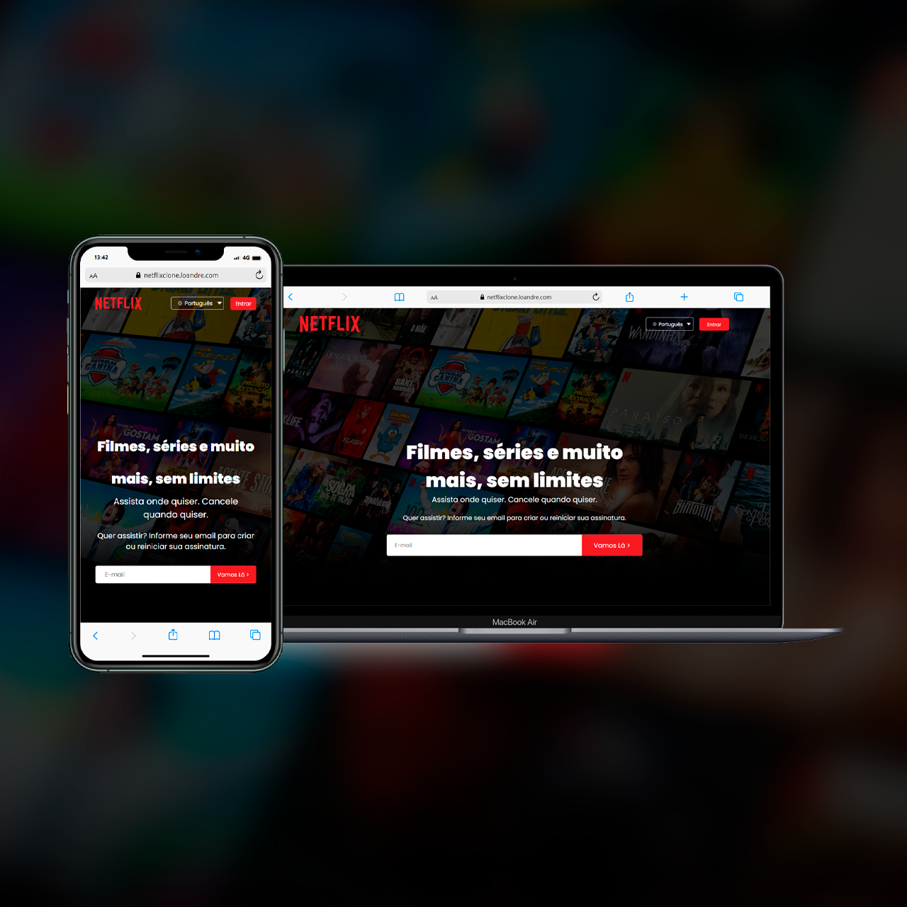

# Digital College - Aula 02

# Projeto Clone da Página Inicial da Netflix



**Descrição do Projeto:** Este é o meu primeiro projeto do curso de Full Stack na Digital College, onde reproduzi um clone da página inicial da Netflix usando apenas HTML e CSS. Esta atividade teve o objetivo de aprimorar minhas habilidades de front-end e me familiarizar com o desenvolvimento web.

## Tecnologias Utilizadas

- HTML5
- CSS3

## Como Executar o Projeto

Você pode executar este projeto em seu navegador da seguinte maneira:

1. **Clone este repositório:**

   ```bash
   git clone https://github.com/loandre/netflixclone.git

**Agradecimentos**

Agradeço à Digital College por fornecer esta oportunidade de aprendizado.

